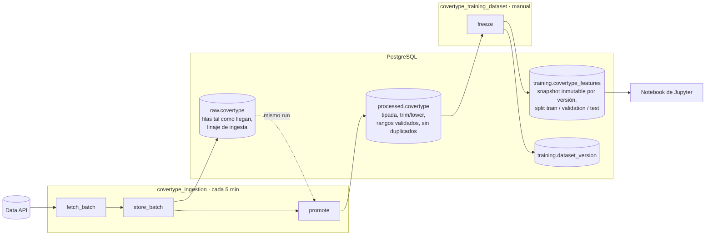
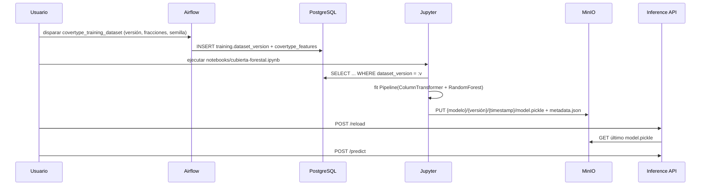
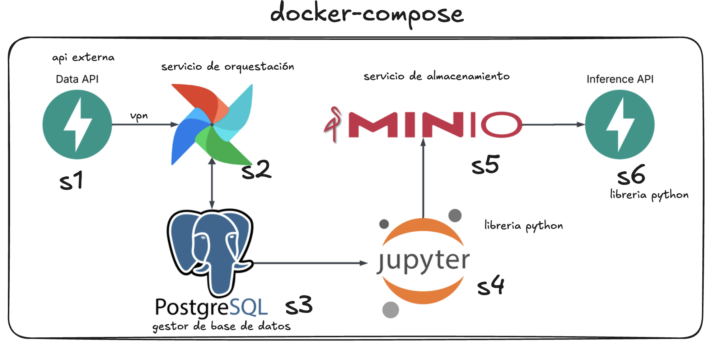
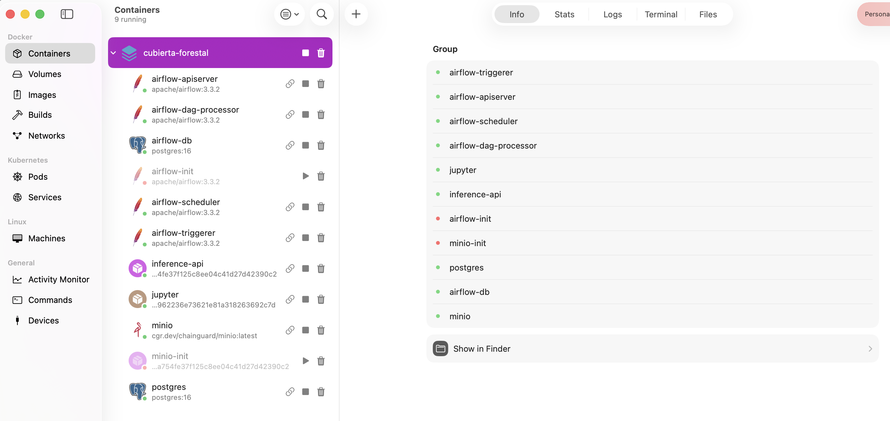
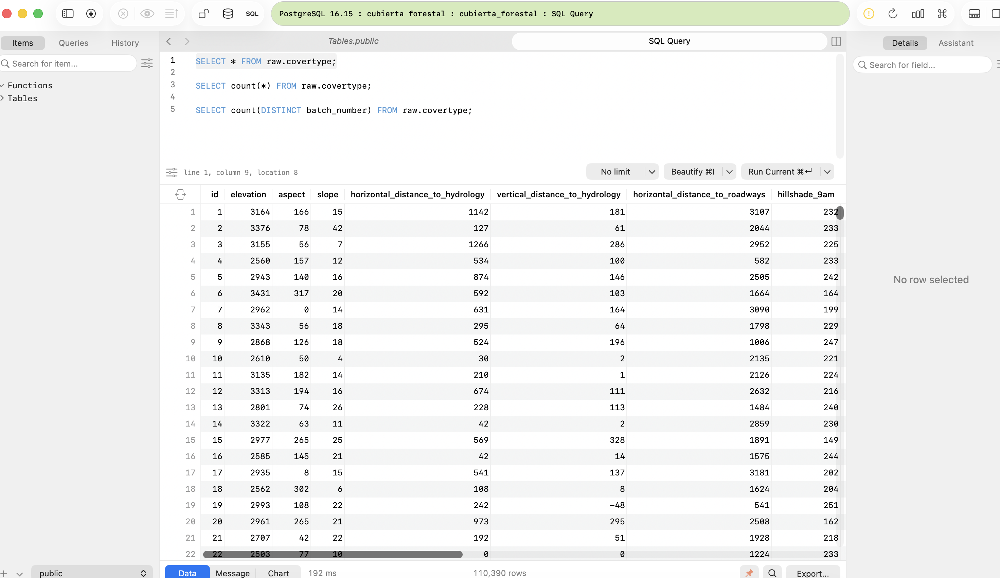
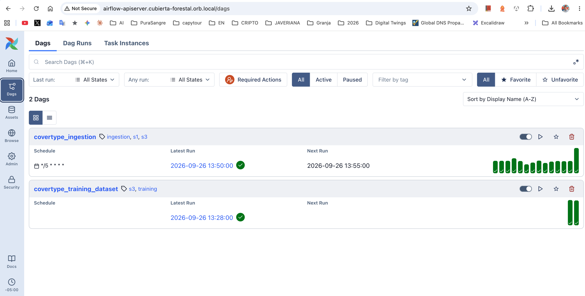
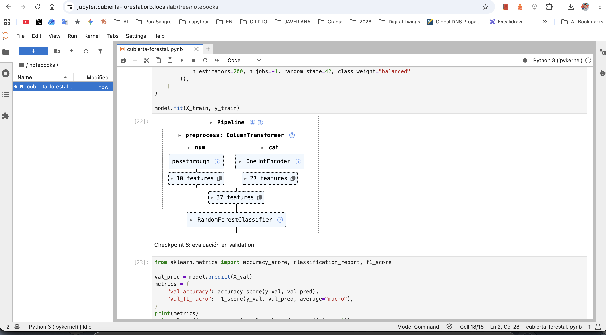
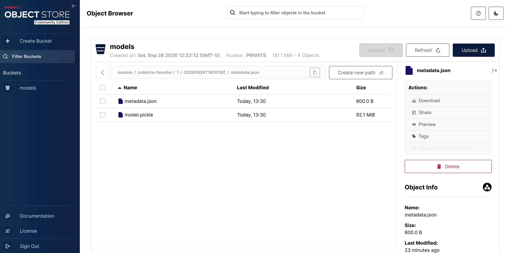

# Cubierta Forestal MLOps

Pipeline MLOps de extremo a extremo para el dataset de cobertura forestal
(covertype): un DAG de Airflow ingiere lotes desde una Data API externa hacia
una base PostgreSQL con tres etapas, un notebook de Jupyter entrena un modelo
de scikit-learn a partir de la etapa de entrenamiento y lo publica en MinIO, y
un servicio FastAPI lo sirve. Todo corre localmente con Docker Compose.

## Ruta rápida

1. Instalar Docker Desktop (u OrbStack) y conectarse a la VPN de la universidad, única vía para alcanzar la Data API.
2. Levantar el stack desde la raíz del repositorio:

   ```bash
   docker compose up -d --build
   ```

3. Abrir Airflow en <http://localhost:8080> (`airflow` / `airflow`), definir la Variable `data_api_group_number` con el número de grupo y activar `covertype_ingestion`. Trae un lote cada 5 minutos.
4. Cuando el DAG empiece a saltar con `Data API returned 400`, el grupo ya recolectó sus 10 lotes. Disparar `covertype_training_dataset` desde la interfaz para congelar un dataset versionado.
5. Abrir Jupyter en <http://localhost:8888> (token `cubierta`), ejecutar `notebooks/cubierta-forestal.ipynb` y verificar el modelo en la consola de MinIO en <http://localhost:9001>.
6. La Inference API responde en <http://localhost:8000/health>.

## Arquitectura

```mermaid
flowchart LR
    S1[("s1 · Data API<br/>externa, vía VPN")]
    S2["s2 · Airflow<br/>covertype_ingestion<br/>covertype_training_dataset"]
    S3[("s3 · PostgreSQL<br/>raw / processed / training")]
    S4["s4 · Jupyter<br/>notebook de entrenamiento"]
    S5[("s5 · MinIO<br/>bucket: models")]
    S6["s6 · Inference API<br/>FastAPI"]

    S1 -- "GET /data cada 5 min" --> S2
    S2 -- "INSERT raw, promoción a processed,<br/>congelado de training" --> S3
    S3 -- "SELECT training.covertype_features" --> S4
    S4 -- "model.pickle + metadata.json" --> S5
    S5 -- "carga del último modelo" --> S6
```



| Servicio | URL | Credenciales | Rol |
|----------|-----|--------------|-----|
| Airflow | <http://localhost:8080> | `airflow` / `airflow` | Orquesta la ingesta y el congelado de datasets |
| PostgreSQL | `localhost:5432`, base `cubierta_forestal` | `app` / `app` | Base de datos de negocio con las tres etapas |
| Jupyter | <http://localhost:8888> | token `cubierta` | Entrena el modelo y lo publica |
| Consola MinIO | <http://localhost:9001> (API en 9000) | `minioadmin` / `minioadmin` | Registro de modelos (bucket `models`) |
| Inference API | <http://localhost:8000> | ninguna | Sirve predicciones con el modelo publicado |

Airflow guarda sus metadatos en una segunda instancia interna de PostgreSQL
(`airflow-db`) con su propio volumen, de modo que la base de negocio solo
contiene datos del proyecto.

## Etapas de datos en PostgreSQL

La base tiene un schema por etapa. Airflow es el único que escribe; Jupyter
solo lee la etapa de entrenamiento.



| Etapa | Tabla | Escrita por | Qué garantiza |
|-------|-------|-------------|---------------|
| Sin procesar | `raw.covertype` | `store_batch` | Exactamente lo que devolvió la API, más `group_number`, `batch_number`, `dag_run_id` e `ingested_at`. Reejecutar un run del DAG reemplaza solo sus propias filas. |
| Procesada | `processed.covertype` | `promote` | Categóricas con `trim` y minúsculas, restricciones `CHECK` en cada rango numérico, duplicados exactos colapsados por un índice único sobre el vector de features, y `raw_id` como referencia al origen. |
| Lista para entrenamiento | `training.covertype_features` + `training.dataset_version` | `freeze` | Un snapshot inmutable por `dataset_version` con un split determinista (`md5(id:seed)`), de modo que todo experimento sobre una versión ve las mismas particiones. Las filas congeladas en un dataset ya no pueden reescribirse aguas arriba. |

El DDL está en `services/postgres/init/001_schemas.sql` y se aplica
automáticamente la primera vez que se crea el volumen de `postgres`. Notas
sobre los datos:

- `cover_type` está indexado desde 0 en esta Data API (clases 0 a 6), a diferencia del original de UCI (1 a 7).
- La clase 3 no aparece en los datos recolectados.
- Las tablas no están en `public`. En psql usar `\dt raw.*`, o consultar con el prefijo del schema:

  ```sql
  SELECT count(DISTINCT batch_number) FROM raw.covertype;   -- 10 cuando la ingesta terminó
  SELECT * FROM training.dataset_version ORDER BY created_at DESC;
  ```

## Ciclo de vida del modelo



Los artefactos se publican bajo `models/<model_name>/<dataset_version>/<trained_at>/`:

| Objeto | Contenido |
|--------|-----------|
| `model.pickle` | Un `Pipeline` de scikit-learn. Espera un `pandas.DataFrame` con las 12 columnas de features por nombre; las dos columnas categóricas son texto y deben normalizarse con `trim` y minúsculas antes de predecir. |
| `metadata.json` | Lista de features, columnas categóricas, target, clases, versión del dataset, timestamp de entrenamiento y métricas. |

Las dos imágenes Docker (`jupyter` y `api`) se construyen desde el mismo
`services/inference-api/pyproject.toml` y `uv.lock`, así el modelo serializado
en entrenamiento se deserializa en servicio con versiones idénticas de las
librerías.

## Estructura del repositorio

```
.
├── docker-compose.yml            # los seis servicios + base de metadatos de Airflow
├── Dockerfile                    # targets: jupyter, api (mismo lockfile)
├── .env.example                  # referencia de cada valor configurable
├── docs/images/                  # evidencias
└── services/
    ├── airflow/
    │   ├── dags/
    │   │   ├── covertype_ingestion.py         # s1 -> raw -> processed
    │   │   ├── covertype_training_dataset.py  # processed -> training (manual)
    │   │   └── covertype_pipeline/            # SQL y helpers compartidos (no es un DAG)
    │   └── tests/                             # integridad de DAGs + tests del pipeline
    ├── postgres/init/001_schemas.sql          # DDL de raw / processed / training
    ├── jupyter/notebooks/                     # montado en /workspace/notebooks
    └── inference-api/                         # proyecto uv, paquete inference_api
        └── src/inference_api/
            ├── main.py                        # app FastAPI
            ├── routers/inference.py           # /health, /reload, /predict
            └── infrastructure/minio_client.py # carga del modelo desde MinIO
```

## Ejecutar las pruebas

Las pruebas de Airflow no necesitan Python local: corren dentro de la imagen de
Airflow contra un PostgreSQL descartable inicializado con el DDL real.

```bash
services/airflow/tests/run.sh
```

| Suite | Qué verifica |
|-------|--------------|
| `test_dag_integrity.py` | Ambos archivos de DAG cargan a través del `DagBag`, cada uno apunta a su propio archivo y ningún argumento de task pisa una clave reservada del contexto como `run_id`. |
| `test_covertype_pipeline.py` | La ingesta es idempotente por run, la promoción normaliza y deduplica, el split es determinista para una semilla, las versiones de dataset son inmutables y las filas congeladas no pueden reescribirse. |

## Operación diaria

| Tarea | Cómo |
|-------|------|
| Editar un DAG | Guardar el archivo. `services/airflow/dags` está montado y se reanaliza en unos 30 s; no requiere rebuild. |
| Guardar un notebook | Guardarlo dentro de `/workspace/notebooks`. Solo esa carpeta está montada; los archivos en otra ruta del contenedor se pierden al recrearlo. |
| Cambiar el código de la API | `docker compose up -d --build inference-api`. |
| Apuntar Airflow a otra Data API | Interfaz de Airflow, Admin > Variables: `data_api_url`, `data_api_group_number`. |
| Inspeccionar la base de datos | `docker exec -it cf-postgres psql -U app -d cubierta_forestal` |
| Empezar desde cero | `docker compose down -v` elimina todos los volúmenes. La Data API no entrega más lotes una vez que un grupo recolectó sus 10, así que conviene hacer un dump de `raw.covertype` antes si se pueden necesitar de nuevo. |

Los valores por defecto están fijados en `docker-compose.yml` para desarrollo
local; `.env.example` documenta cada uno de ellos.

## Solución de problemas

- **`\dt` no muestra tablas.** El `search_path` por defecto es `public`. Usar `\dt raw.*`, `\dt processed.*`, `\dt training.*`.
- **`promote` falla pero `store_batch` terminó bien.** Las filas están a salvo en `raw`; corregir la causa y limpiar la task desde la interfaz, la promoción es idempotente por run.
- **`fetch_batch` se salta con un 400.** Esperado una vez que el grupo tiene sus 10 lotes.
- **Un DAG nuevo no aparece.** Los archivos nuevos se descubren cada 5 min; las ediciones a los existentes, en 30 s. Revisar `docker exec cf-airflow-apiserver airflow dags list-import-errors`.
- **MinIO responde 502 en el dominio de OrbStack.** El contenedor fue recreado y el proxy todavía apunta a la IP anterior; se corrige solo en menos de un minuto.

## Evidencias

### 1. Servicios en Docker Compose

Diagrama de los seis servicios y sus conexiones, y el stack levantado en OrbStack con los nueve contenedores del proyecto `cubierta-forestal`. Los dos que aparecen detenidos (`airflow-init`, `minio-init`) son tareas de inicialización que terminan al completar su trabajo.





### 2. Datos en PostgreSQL

Consulta sobre `raw.covertype` con las filas ingeridas desde la Data API.



### 3. DAGs en Airflow

Los dos DAGs registrados: `covertype_ingestion` programado cada 5 minutos con sus runs exitosos, y `covertype_training_dataset` de disparo manual.



### 4. Pipeline de entrenamiento

Notebook en Jupyter con el `Pipeline` ajustado: `ColumnTransformer` con paso directo para las 10 features numéricas y `OneHotEncoder` para las categóricas, seguido de `RandomForestClassifier`.



### 5. Modelo publicado en MinIO

Bucket `models` con el artefacto `cubierta-forestal/1/20260926T183018Z/`: `model.pickle` y su `metadata.json`.


